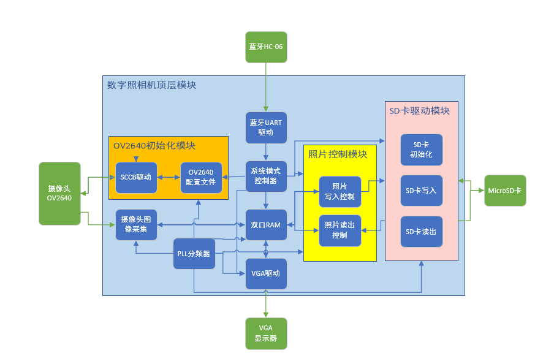

# FPGA-DigitalCamera
Final Project for Digitial Logic (Fall 2021) , CS102109, Tongji University.

注意！使用SD卡进行照片传输时必须先初始化SD卡，并通过项目自带的工具先将8张照片转换成bin文件，把bin文件复制到SD卡目录下，否则会导致照片无法正常读取或者无法利用满8个槽位的空间！

支持以下操作：
- 将电脑照片导入到SD卡中并在VGA显示器上显示（通过jpg2bin.py转换）
- 通过蓝牙控制拍摄照片（较慢，需3s左右）
- 回看过去拍摄的照片
- 将照片从SD卡中取出导入到电脑中（通过bin2jpg.py转换）

蓝牙指令控制，具体指令好像没有保存，记不清了，请查阅源码。源文件中给出的bin文件在22年1月验收时可以稳定运行。

整体框架设计:

Basic board: Nexys4 DDR

使用的模块:

- Camera OV2460
- Bluetooth HC-06
- VGA display screen 480P 60Hz
- SD Card with SPI proxy

未解决的问题：
- 相机的缩放、明度和对比度修正.（查阅到了OV2460的原始手册，但通过手册上的控制指令无法修改，如果您可以解决该问题欢迎在Issues中指出解决方案，非常感谢！）

Reference Repository: <a herf="https://github.com/lllbbbyyy/FPGA-OV2640">FPGA-OV2640 </a>
