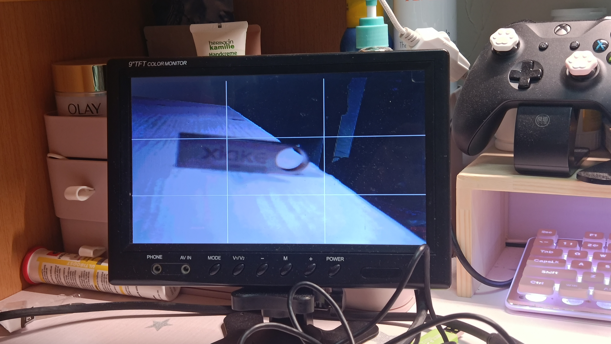
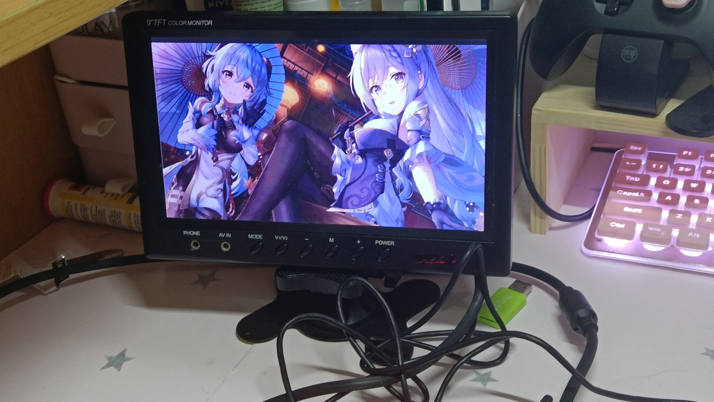
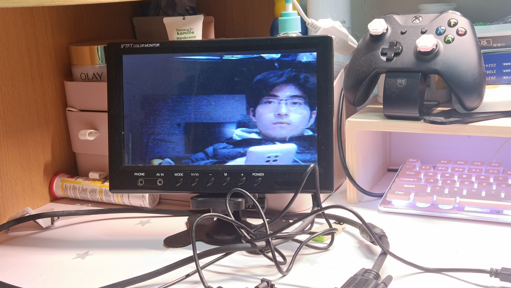
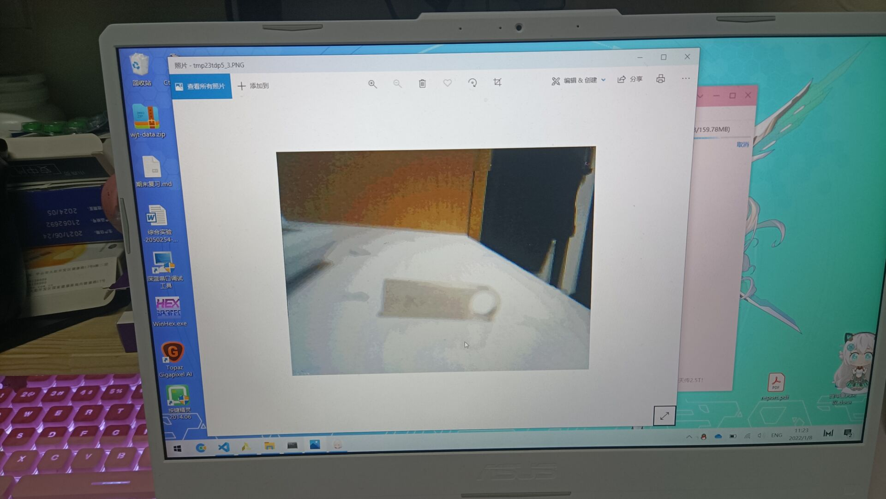
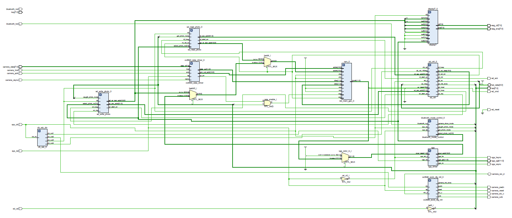

# FPGA-DigitalCamera
Final Project for Digitial Logic (Fall 2021) , CS102109, Tongji University.

Example Pictures:
- Capture Mode

- Display Mode (Imported photo)

- Display Mode (Local captured photo)

- Display captured photo on computer

Frame & RTL
- frame design:

- RTL design:

Basic board: Nexys4 DDR

Models used:

- Camera OV2460
- Bluetooth HC-06
- VGA display screen 480P 60Hz
- SD Card with SPI proxy

Designed functions:

- SD Card photo save&read
- Camera shooting

- Bluetooth remote control
- Extensive working indicators

Unsolved problems:

- Camera zoom , bright & contrast control.

Hope that someone who solved the problem can contact me or pull an issue. Thanks a lot :)

2024.5.26更新:
照片在电脑上写入SD卡/读取方式：需要先往SD卡中写入一个bin文件（因为只能写入未经压缩的照片），然后通过python脚本转换（印象里是600K一张文件，8个照片槽的地址是连续的，然后调用python的image包，脚本已经找不到了T T），对SD卡的读写操作都是通过这种方式进行

Reference Repository: <a herf="https://github.com/lllbbbyyy/FPGA-OV2640">FPGA-OV2640 </a>
